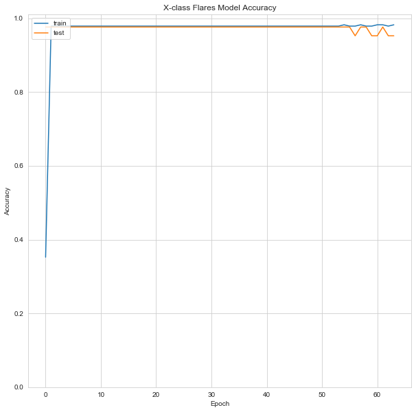

# Predicting Solar Flares with Using XGBoost and Artificial Neural Networks

## Problem Statement

The purpose of this study is based on the available data, it was estimated whether flares are **common, moderate or severe**. In addition, the ***solar_flare_area_XGBoost.py*** algorithm that estimates the size of the fires has been indicated.

     

## Datasets

Datasets are downloaded from [archive.ics.uci.edu](https://archive.ics.uci.edu/ml/datasets/Solar+Flare) website. You can find the details of the datasets in that website and also in the ***flare.names*** named file. **flare.data1** dataset has **13 columns** and **323 rows without the header** and **flare.data2** dataset has **13 columns** and **1066 rows without the header**.

**Attribute Information:**

1. Code for class (modified Zurich class) (A,B,C,D,E,F,H)  
2. Code for largest spot size (X,R,S,A,H,K)  
3. Code for spot distribution (X,O,I,C)  
4. Activity (1 = reduced, 2 = unchanged)  
5. Evolution (1 = decay, 2 = no growth, 3 = growth)  
6. Previous 24 hour flare activity code (1 = nothing as big as an M1, 2 = one M1, 3 = more activity than one M1)  
7. Historically-complex (1 = Yes, 2 = No)  
8. Did region become historically complex on this pass across the sun's disk (1 = yes, 2 = no)  
9. Area (1 = small, 2 = large)  
10. Area of the largest spot (1 = <=5, 2 = >5)  
  
**From all these predictors three classes of flares are predicted, which are represented in the last three columns.** 
  
11. C-class flares production by this region in the following 24 hours (common flares); Number  
12. M-class flares production by this region in the following 24 hours (moderate flares); Number  
13. X-class flares production by this region in the following 24 hours (severe flares); Number

Source:
 - https://archive.ics.uci.edu/ml/datasets/Solar+Flare

Donor:    

Gary Bradshaw: gbradshaw@clipr.colorado.EDU

## Methodology

In this project, as stated in the title, results were obtained through **XGBoost** and **artificial neural networks** methods. 

## Analysis

### flare.data1 Dataset

| # | Column | Non-Null Count | Dtype |
|--|--|--|--|
| 0 | 0 | 323 non-null | object
| 1 | 1 | 323 non-null | object
| 2 | 2 | 323 non-null | object
| 3 | 3 | 323 non-null | int64
| 4 | 4 | 323 non-null | int64
| 5 | 5 | 323 non-null | int64
| 6 | 6 | 323 non-null | int64
| 7 | 7 | 323 non-null | int64
| 8 | 8 | 323 non-null | int64
| 9 | 9 | 323 non-null | int64
| 10 | 10 | 323 non-null | int64
| 11 | 11 | 323 non-null | int64
| 12 | 12 | 323 non-null | int64

### flare.data2 Dataset

| # | Column | Non-Null Count | Dtype |
|--|--|--|--|
| 0 | 0 | 1066 non-null | object
| 1 | 1 | 1066 non-null | object
| 2 | 2 | 1066 non-null | object
| 3 | 3 | 1066 non-null | int64
| 4 | 4 | 1066 non-null | int64
| 5 | 5 | 1066 non-null | int64
| 6 | 6 | 1066 non-null | int64
| 7 | 7 | 1066 non-null | int64
| 8 | 8 | 1066 non-null | int64
| 9 | 9 | 1066 non-null | int64
| 10 | 10 | 1066 non-null | int64
| 11 | 11 | 1066 non-null | int64
| 12 | 12 | 1066 non-null | int64

**Number of Instances:** 1389

**Number of Attributes:** 10

**Area:** Physical

**Data Set Characteristics:** Multivariate

**Attribute Characteristics:** Categorical

## Predicting Flare Area

For the area prediction I used ***flare.data2*** dataset.

Confusion Matrix(XGBoost):

| 341 | 4 |
|--|--|
| **1** | **6** |

**Prediction of XGBoost:**
Model predicted as **small.**
Model predicted class as **[0.].**

> **Accuracy score(XGBoost): 0.9857954545454546**

Process took 0.16031527519226074 seconds.

## Predicting Flare Classes

 1. #### Predicting C-class

Confusion Matrix(XGBoost):

| 95 | 6 | 2 |
|--|--|--|
| **2** | **1** | **1** |
| **0** | **0** | **0** |

**Prediction of XGBoost:**

Model predicted class as **[0.].**

> **Accuracy score (XGBoost): 0.897196261682243**

**Prediction of ANNs:**

Model predicted class as **[0].**

     

> **Mean of validation accuracy: 0.8809523582458496**

---

2. #### Predicting M-class

**Confusion Matrix(XGBoost):**

| 94 | 7 | 2 | 1 |
|--|--|--|--|
| **3** | **0** | **0** | **0** |
| **0** | **0** | **0** | **0** |
| **0** | **0** | **0** | **0** |

**Prediction of XGBoost:**

Model predicted class as **[0.].**

> **Accuracy score (XGBoost): 0.8785046728971962**

**Prediction of ANNs:**

Model predicted class as **[0].**

     

> **Mean of validation accuracy: 0.8318452244857326**

---

3. #### Predicting X-class

**Confusion Matrix(XGBoost):**

| 106 | 1 |
|--|--|
| **0** | **0** |

**Prediction of XGBoost:**

Model predicted class as **[0.].**

> **Accuracy score (XGBoost):  0.9906542056074766**

**Prediction of ANNs:**

Model predicted class as **[0].**

     

> **Mean of validation accuracy: 0.9758184244856238**

Process took 7.384896755218506 seconds.

## How to Run Code

Before running the code make sure that you have these libraries:

 - pandas 
 - time
 - sklearn
 - seaborn
 - numpy
 - warnings
 - xgboost
 - matplotlib
 - keras
 - statistics
    
## Contact Me

If you have something to say to me please contact me: 

 - Twitter: [Doguilmak](https://twitter.com/Doguilmak)
 - Mail address: doguilmak@gmail.com
 
